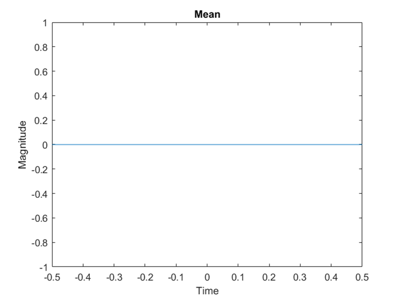

# CA3
communication
In this project, the aim is to examine some parts of statistics and probability under the title of Rayleigh distribution and its characteristics, then get familiar with the random process and observe a process and recognize its type and characteristics, and finally get to know relatively little about digital telecommunications and how to receive and publish a The message in this way and its relation to analog communication will be analyzed separately.

